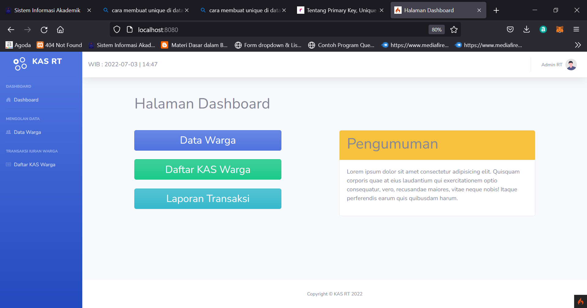
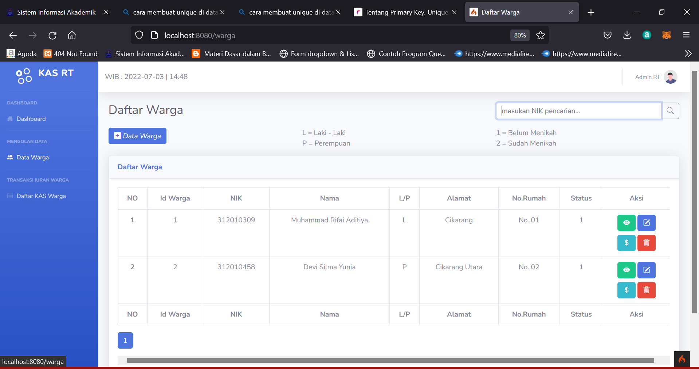
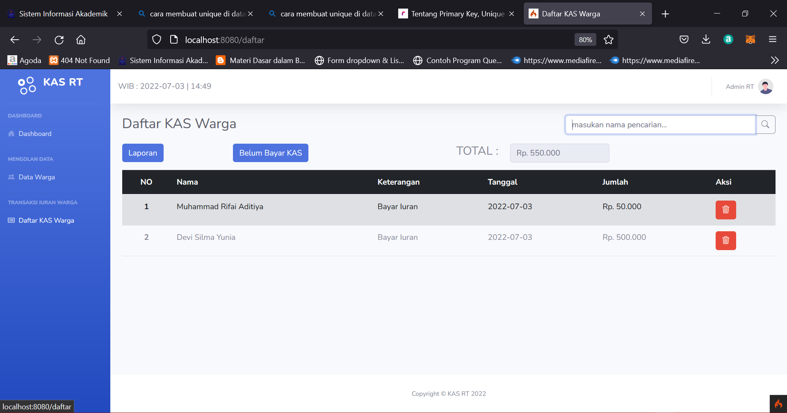

# Nama  : Muhammad Rifai Aditiya
# Nim   : 312010065
# Kelas : TI.20.A1
# Mata kuliah : Bahasa Pemrograman

# UAS PEMROGRAMAN 

# 1. INI MERUPAKAN LAYOUT DARI DASBROARD

# 2. INI MERUPAKAN LAYOUT DARI DATA WARGA 

# 3. INI ADALAH LAYOUT DAFTAR KAS WARGA 

# TERIMAKASIH 

# SELAMAT MENJALANKAN UJIAN AKHIR SEMESTER 
